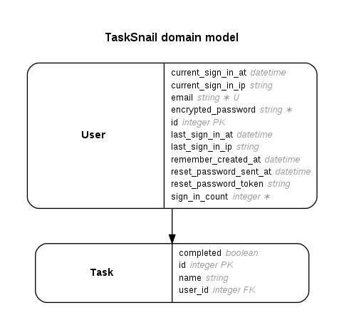

# TaskSnail

Inspired by https://github.com/codediodeio/tasksnail

Files added to `app/views`
```
+ _task.html.erb
+ complete.js.erb
+ create.js.erb
+ destroy.js.erb
+ edit.js.erb
+ new.js.erb
+ update.js.erb
```
One page app where users can View, Create, Update and Delete Tasks. They can also mark Tasks complete. CRUD implemented using AJAX in Rails 5.



Inspired by https://github.com/codediodeio/tasksnail

* Ruby version: ruby 2.3.3p222 (2016-11-21 revision 56859) [x86_64-linux]

* Rails version: Rails 5.0.1